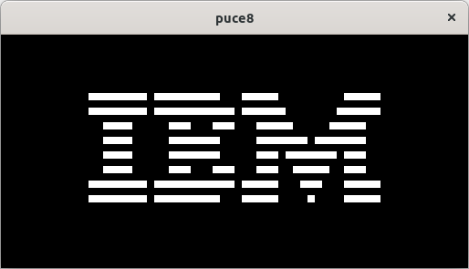
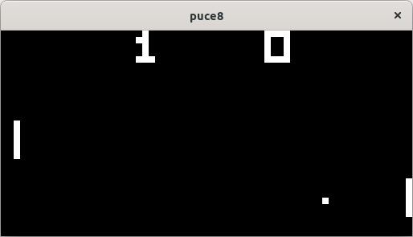

# puce8
A chip8 emulator.

You can compile and run it on your machine or use it in your browser [here](https://mpostaire.github.io/puce8).

## Screenshots





## Build

```bash
# 1. Clone this repository
git clone https://github.com/mpostaire/puce8.git
# 2. cd into the cloned repository
cd puce8
# 3. Compile puce8 (quick run: cargo run -- path/to/bin.ch8)
cargo build --release
# 4. The binary is located in the target/release directory
cd target/release
# 5. Run it
./puce8 path/to/bin.ch8
```

<!-- # wasm build:
cargo build --target=wasm32-unknown-emscripten --release -->

## Resources used

- https://tobiasvl.github.io/blog/write-a-chip-8-emulator/
- https://github.com/Timendus/chip8-test-suite
